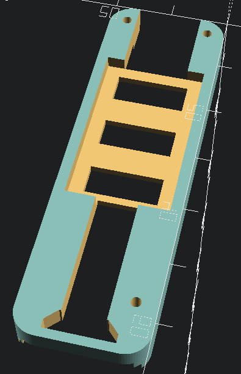
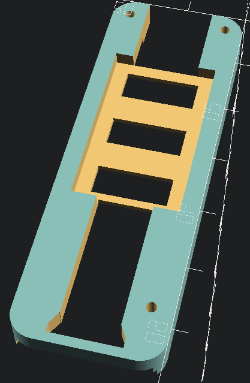

# DNA Board Holders

This repository provides board holders for the Evolv DNA series of DC-DC converters.
## Supported Boards

| Model | Status      |
| ----- | ----------- |
| 75    | Not planned |
| 200   | Not planned |
| 250   | Not planned |
| 75C   | Complete    |
| 250C  | Complete    |
| 100C  | Not started |

### 75C

### 250C

## Printing

Recommended print settings:

| Setting      | Value  |
| ------------ | ------ |
| Perimeters   | 3+     |
| Layer Height | ~0.2mm |
| Infill       | 20%    |
| Supports     | Off    |
| Raft         | Off    |
| Brim         | Off    |
